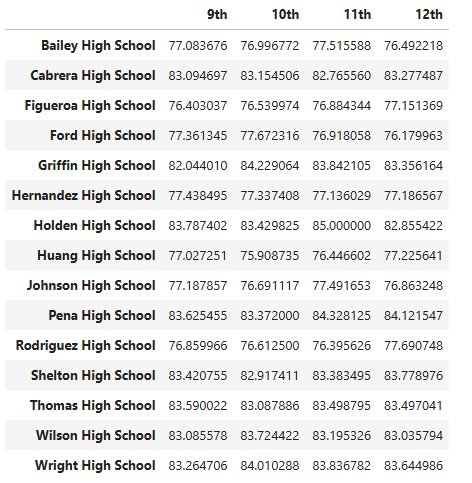
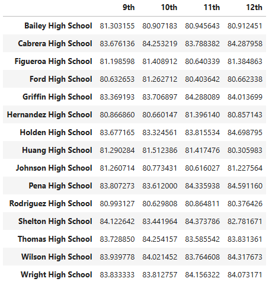
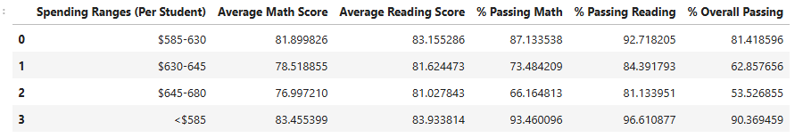
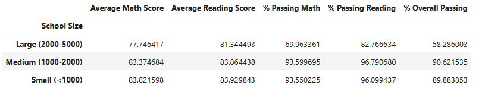
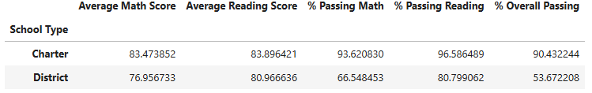

# pandas-challenge
(starter code for this challenge was provided via the course, hence the main jupyter file still being named: PyCitySchools_starter)

## Description
The `pandas-challenge` project consists of a Python script designed to analyze school and student data. The analysis focuses on generating insights that can help the school board and mayor make strategic decisions regarding future school budgets and priorities.

## Summary
This analysis examines various metrics related to school performance, with the goal of helping the school board and local governmnet make informed decisions about future school budgets and priorities. The analysis focuses of understanding the relationships between school budgets, sizes, types, and student performances, primarily in math and reading scores.

## District Summary
The **District Summary** section provides an overview of the entire district with the following metrics:
- **Total Schools**: Total number of schools in the district.
- **Total Students**: Total number of students across the district.
- **Total Budget**: The total budget allocated to the district.
- **Average Math Score**: The overall average math score for all students.
- **Average Reading Score**: The overall average reading score for all students.
- **% Passing Math**: Percentage of students who passed the math exam.
- **% Passing Reading**: Percentage of students who passed the reading exam.
- **% Overall Passing**: Percentage of students who passed both math and reading exams.

## School Summary
The **School Summary** section provides detailed metrics for each school in the district:
- **School Type**: Classification of each school (e.g., District or Charter).
- **Total Students**: Number of students enrolled in each school.
- **Total School Budget**: Total budget allocated to each school.
- **Per Student Budget**: Budget allocated per student in each school.
- **Average Math Score**: Average math score for each school.
- **Average Reading Score**: Average reading score for each school.
- **% Passing Math**: Percentage of students passing math per school.
- **% Passing Reading**: Percentage of students passing reading per school.
- **% Overall Passing**: Percentage of students passing both subjects per school.

## Key Insights
## Spending Ranges (Per Student)
- Schools were categorized into different spending ranges to analyze how budget allocation affects performance. Based on the analysis:
	  - Schools with lower per-student spending (<$585) showed higher overall passing rates (90.37%).
	     compared to schools with higher spending ranges ($630-$645) which has a significantly lower passing rate (62.86%).

- This trend suggests that increasing spending per student does not necessarily correlate with higher academic performance.

### Highest-Performing Schools (by % Overall Passing)
The top 5 highest-performing schools based on % Overall Passing are:
- Cabrera High School
- Thomas High School
- Griffin High School
- Wilson High School
- Pena High School
  
### Lowest-Performing Schools (by % Overall Passing)
The bottom 5 lowest-performing schools based on % Overall Passing are:
- Rodriguez High School
- Figueroa High School
- Huang High School
- Hernandez High School
- Johnson High School

## Math and Reading Scores by Grade:
- Math and reading scores were consistant across different grades, with slights variations among schools. No significant drop-off was found as students progressed to higher grades. Below, you will find an image of both math and reading scores:
  
### Math Scores:
The average math scores for students in each grade:

### Reading Scores:
The average reading scores for students in each grade:

### Scores by School Spending
Schools are categorized into spending ranges per student:

## School Size:
- Schools are categorized into three size ranges to observe the impact of school size performance:
	  - Small and medium sized schools performed better, with overall passing rates around 895 and 90%. In contrast, large schools (2000-5000 students) had a much lower passing rate of 58.29%. This trend suggests that smaller schools might be able to provide a more personalized learning environment, leading to better student outcomes.

### Scores by School Size
Schools are categorized based on size:
- **Small (< 1000 students)**
- **Medium (1000 - 2000 students)**
- **Large (2000 - 5000 students)**

The analysis presents the average scores and passing percentages for each size category.

### Scores by School Type
Analyzing the performance by school type, shows a significant difference between Charter and District schools:

- Charter Schools outperformed District schools in all catergories, with a higher passing rate of (90.43% vs. 53.67%).

- Charter schools also showed higher average math and reading scores, as well as a higher percentage of students passing both. No significant drop-off was observed as students progressed to higher grades. This most likely indicates a consistant level of education across all grade levels.

## Conclusions
1. Spending Efficiency: Higher spending per student does not necessarily translate to better academic performance. Schools with lower per-student spending performed better in terms of overall passing rates, indicating that efficient resources allocation and management are more critical than the actual total amount spent of each student.

2. School Type Matters: Charter schools consistently outperform District schools in all categories. This suggests that Charter schools may benefit from a more flexible administrative practice than that of District schools. Allowing for a better adaption to student needs.

## Contact Information
For questions or additional information, please feel free to reach out:

- **Email**: ilir.hajdari111@gmail.com

